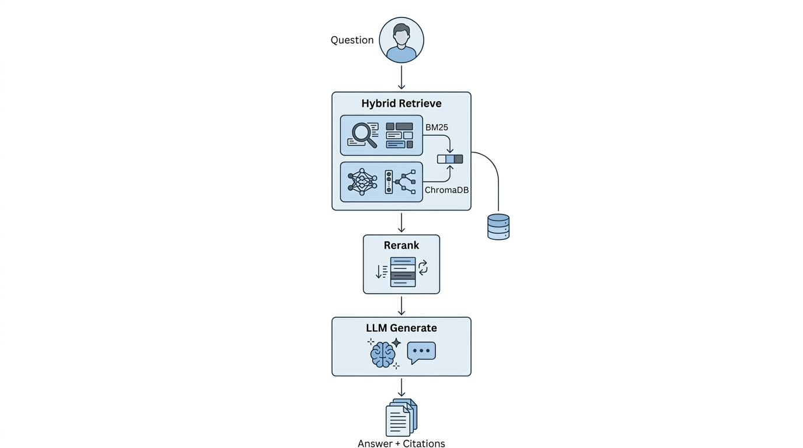

# RAG System

<div align="center">



**Production-Grade Retrieval-Augmented Generation (RAG) System**

Hybrid Retrieval • Cross-Encoder Reranking • Citation Enforcement • Automated Evaluation

[](https://github.com/Khubaib008/Domain-Specific-Ask-My-Doc-System/actions/workflows/evaluate.yml)
[](https://www.python.org/)
[](LICENSE)

</div>

---

## Overview

This project implements a **production-grade Retrieval-Augmented Generation (RAG) pipeline** designed for domain-specific question answering.

The system combines:

* **Dense Retrieval** using Gemini embeddings and ChromaDB
* **Sparse Retrieval** using BM25
* **Hybrid Search** via Reciprocal Rank Fusion (RRF)
* **Cross-Encoder Reranking** using Cohere
* **Strict Citation Enforcement**
* **Automated Evaluation** using Ragas
* **LangGraph-based Workflow Orchestration**
* **FastAPI Deployment**

The objective is to generate answers that are:

--Relevant
--Faithful to source documents
--Fully cited
--Automatically evaluated through CI/CD

---

# Key Features

| Capability            | Description                                                   |
| --------------------- | ------------------------------------------------------------- |
| Hybrid Retrieval      | Combines semantic and keyword search                          |
| ChromaDB Vector Store | Persistent embedding storage                                  |
| Gemini Embeddings     | High-quality dense retrieval                                  |
| BM25 Search           | Traditional sparse retrieval                                  |
| RRF Fusion            | Merges retrieval signals without score normalization          |
| Cohere Reranking      | Cross-encoder relevance optimization                          |
| Citation Enforcement  | Every factual statement must be grounded in retrieved sources |
| LangGraph Workflow    | Modular retrieval → rerank → generation pipeline              |
| Prompt Versioning     | YAML-based prompt management                                  |
| FastAPI Service       | REST API for inference                                        |
| Automated Evaluation  | Faithfulness and relevancy scoring with Ragas                 |
| GitHub Actions CI     | Quality gates enforced automatically                          |

---

# System Architecture

The pipeline follows a multi-stage retrieval and generation workflow:

```text
User Question
      │
      ▼
┌───────────────────────┐
│ Hybrid Retrieval      │
│ ChromaDB + BM25       │
└──────────┬────────────┘
           │
           ▼
┌───────────────────────┐
│ RRF Fusion            │
│ Top-K Candidate Docs  │
└──────────┬────────────┘
           │
           ▼
┌───────────────────────┐
│ Cohere Reranker       │
│ Top-N Relevant Docs   │
└──────────┬────────────┘
           │
           ▼
┌───────────────────────┐
│ LLM Generation        │
│ Citation Enforcement  │
└──────────┬────────────┘
           │
           ▼
     Final Answer
     + Citations
```

---

# Technology Stack

## Retrieval

* ChromaDB
* BM25
* Gemini Embeddings
* Reciprocal Rank Fusion (RRF)

## Generation

* Gemini Models

## Orchestration

* LangGraph
* LangChain

## Evaluation

* Ragas
* Golden Dataset Testing

## Deployment

* FastAPI
* Uvicorn

## DevOps

* GitHub Actions
* Automated Quality Gates

---

# Quick Start

## Prerequisites

* Python 3.12+
* Gemini API Key

Optional:

* Cohere API Key (for reranking)

---

## Clone Repository

```bash
git clone https://github.com/Khubaib008/Domain-Specific-Ask-My-Doc-System.git
cd rag-system
```

## Create Virtual Environment

```bash
python -m venv .venv
```

Linux / macOS

```bash
source .venv/bin/activate
```

Windows

```bash
.venv\Scripts\activate
```

## Install Dependencies

```bash
pip install -r requirements.txt
```

---

# Configuration

Create a `.env` file:

```env
GEMINI_API_KEY=your_api_key

GEMINI_CHAT_MODEL=gemini-2.5-flash-lite
GEMINI_EMBEDDING_MODEL=models/gemini-embedding-001

COHERE_API_KEY=your_cohere_key
```

---

# Running the Application

Start the API server:

```bash
uvicorn src.api.server:app --reload --port 8000
```

Open:

```text
http://localhost:8000/docs
```

to access Swagger UI.

---

# API Endpoints

## Health Check

```http
GET /health
```

Example response:

```json
{
  "status": "healthy",
  "version": "2.0.0",
  "vector_store_count": 4,
  "bm25_built": true
}
```

---

## Ask Question

```http
POST /ask
```

Request:

```json
{
  "question": "What is machine learning?",
  "top_k": 15,
  "rerank_top_n": 5
}
```

Uses:

* Hybrid Retrieval
* RRF Fusion
* Cohere Reranking
* Citation-Enforced Generation

---

## Baseline Pipeline

```http
POST /ask/baseline
```

Uses vector retrieval only.

Useful for:

* A/B testing
* Evaluation comparisons
* Retrieval experiments

---

# Testing

Run Phase 1 tests:

```bash
python test_phase1.py
```

Run Phase 2 tests:

```bash
python test_phase2.py
```

---

# Evaluation

The project includes a curated golden dataset consisting of **50 question-answer pairs**.

Evaluation is performed using **Ragas**.

Run full evaluation:

```bash
python run_eval.py --threshold 0.85
```

Quick smoke test:

```bash
python run_eval.py --questions 5
```

### Metrics

| Metric           | Threshold |
| ---------------- | --------- |
| Faithfulness     | ≥ 0.85    |
| Answer Relevancy | ≥ 0.70    |

GitHub Actions automatically fails builds if thresholds are not met.

---

# Project Structure

```text
rag-system/
│
├── .github/
│   └── workflows/
│       └── evaluate.yml          # CI: test → evaluate → quality gate
│
├── data/
│   ├── sample_docs/
│   │   ├── ai_basics.md          # Sample knowledge base document
│   │   └── transformers.md       # Sample knowledge base document
│   └── golden_dataset.json       # 50 Q&A pairs for Ragas evaluation
│
├── docs/
│   └── architecture.jpeg         # System architecture diagram
│
├── prompts/
│   ├── __init__.py
│   └── rag_prompts/
│       ├── v1.yaml               # Baseline prompts (no reranker)
│       └── v2.yaml               # Phase 2 prompts (reranker-aware)
│
├── src/
│   ├── __init__.py
│   ├── api/
│   │   ├── __init__.py           # Exports FastAPI app
│   │   ├── schemas.py            # Pydantic request/response models
│   │   └── server.py             # FastAPI server with lifespan + endpoints
│   ├── evaluation/
│   │   ├── __init__.py           # Exports RagEvaluator, load_golden_dataset
│   │   ├── evaluator.py          # Ragas faithfulness + answer_relevancy
│   │   └── golden_dataset.py     # JSON ↔ DataFrame loader
│   ├── generation/
│   │   ├── __init__.py           # Exports PromptManager, build_rag_graph
│   │   ├── graph.py              # LangGraph: RagState, nodes, build_rag_graph
│   │   └── prompts.py            # PromptManager: YAML versioned prompts
│   ├── ingestion/
│   │   ├── __init__.py           # Exports loaders + chunk_documents
│   │   ├── loaders.py            # PDF, Markdown, Web loaders
│   │   └── splitter.py           # RecursiveCharacterTextSplitter (tiktoken)
│   └── retrieval/
│       ├── __init__.py           # Exports all retrieval classes
│       ├── vector_store.py       # ChromaDB wrapper + embedding factory
│       ├── bm25_index.py         # BM25Okapi sparse index + pickle
│       ├── hybrid_retriever.py   # RRF fusion of vector + BM25
│       └── reranker.py           # Cohere cross-encoder reranker
│
├── tests/
│   ├── __init__.py
│   └── conftest.py               # Pytest fixtures
│
├── run_eval.py                   # CLI evaluation runner
├── test_phase1.py                # Phase 1 verification (5 tests)
├── test_phase2.py                # Phase 2 verification (7 tests)
├── pyproject.toml                # Project metadata + pytest config
├── requirements.txt              # All dependencies
├── LICENSE                       # MIT License
└── README.md
```

---

# Engineering Highlights

* Hybrid dense + sparse retrieval
* Reciprocal Rank Fusion (RRF)
* Cross-encoder reranking
* Citation-grounded generation
* Prompt versioning
* Automated evaluation
* CI/CD quality gates
* Modular architecture for easy extension

---

# License

Licensed under the MIT License.

See the [LICENSE](LICENSE) file for details.

---
